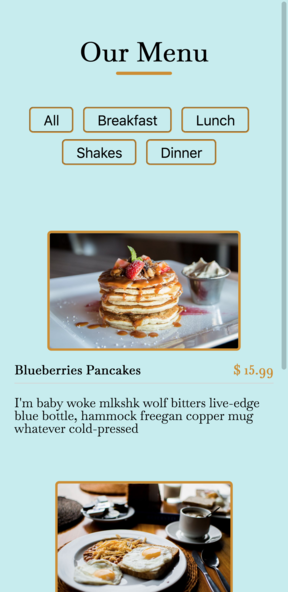
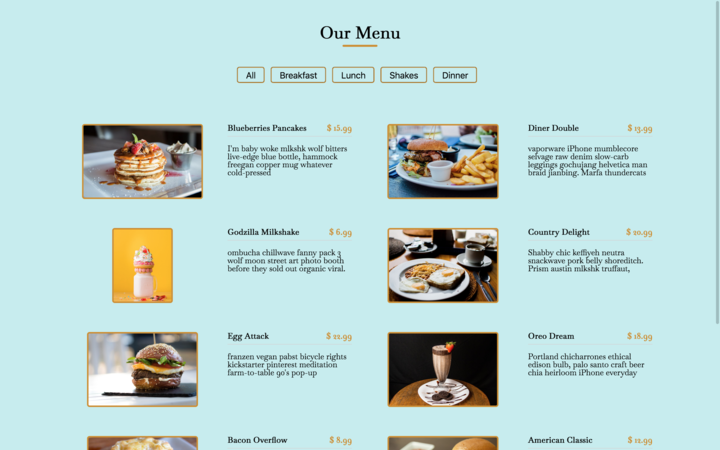

# Menu

Creating a restaurant menu page 😋

The aim is simply to practice and understand key concepts

Local data is used in here to understand and apply step by step how to deal with data and placing them dynamically.

Key concept covered 

    arrays
    objects
    forEach()
    DOMContentLoaded
    map, reduce, and filter
    innerHTML
    includes method

Javascript function such as **map, reduce and filter** are some very useful function.

Articles and buttons are loaded dynamically in my webpage and it was interresting to remind some concept.

Filter let me to show each article by his category.

The page is also responsive for any devices

